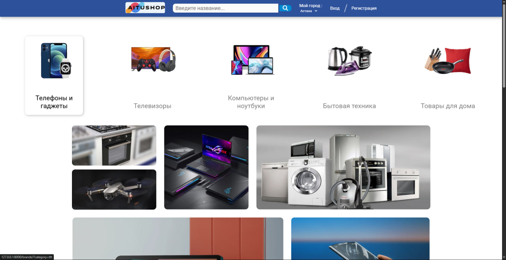
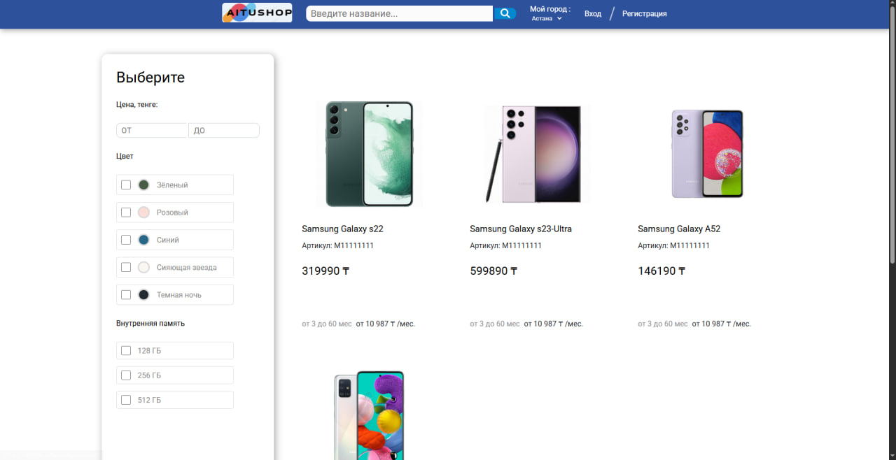
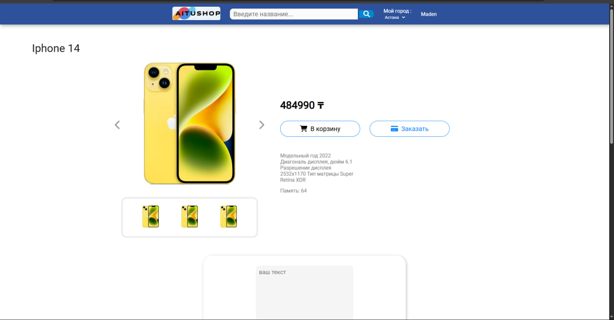

# 🛒 Store

Веб-приложение онлайн-магазина на **Python/Django**.  
Позволяет добавлять, редактировать и удалять товары через веб-интерфейс.

---

## 🖼️ Скриншоты

| Главная страница | Каталог товаров | Добавление товара |
|-----------------|-----------------|-----------------|
|  |  |  |

---

## 🚀 Функционал

- Регистрация и авторизация пользователей  
- CRUD-операции с товарами (создание, редактирование, удаление)  
- Админка Django для управления контентом  
- Сортировка и поиск товаров  

---

## 🧩 Технологии и стек

- **Язык:** Python 3  
- **Фреймворк:** Django  
- **База данных:** PostgreSQL / SQLite3  
- **Frontend:** HTML, CSS, Django Templates  
- **Инструменты:** Git, VS Code  

---

## 💡 О проекте

Учебный веб-проект для изучения Django и работы с базой данных.  
Фокус на моделях, представлениях и шаблонах, а также на взаимодействии с пользователем через веб-интерфейс.

---

## 🔗 Автор

**IDGAF F**  
📍 Astana, Kazakhstan  
[GitHub](https://github.com/IDGAFM)
